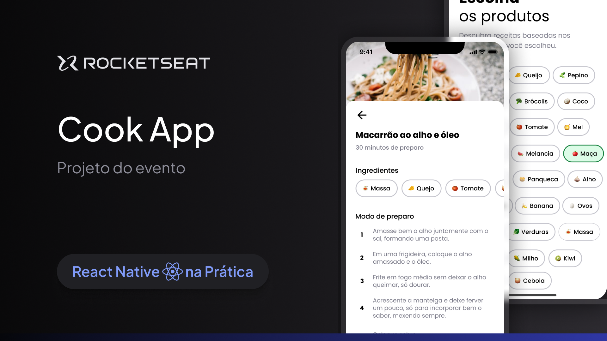

<h1 align="center">
  
</h1>

### Links

🔴 **Assista meus vídeos no YouTube:** [@orodrigogo](https://www.youtube.com/@orodrigogo)

🔴 **Figma do projeto:** [Cook App](https://www.figma.com/community/file/1346604268107725445/cook-app)

---

<h1 align="center">
  
</h1>

### Sobre o projeto

Imagine chegar em casa com fome depois de um dia de muito trabalho e lembrar que você esqueceu de passar no mercado para fazer as compras da semana. Então você decide abrir a geladeira pra fazer uma janta com o que já tem em casa, mas está sem muita criatividade pra cozinhar.
**É esse problema que o Cook App pode resolve!** Nessa aula do evento React Native na prática vamos criar uma aplicação que sugere receitas conforme os ingredientes selecionados **usando React Native, Expo, Expo router, Supabase e React Native reanimated**.
